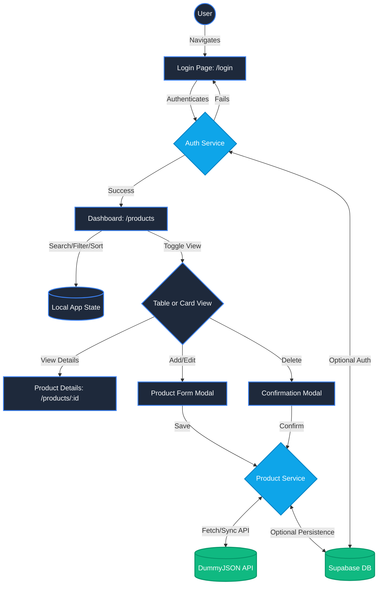

# NOVA - Architecture & Application Flow

## Technologies Used

NOVA is a modern, responsive web application built with the following stack:

*   **Framework**: [Next.js 16](https://nextjs.org/) (App Router)
*   **Library**: [React 19](https://react.dev/)
*   **Styling**: [Tailwind CSS 4](https://tailwindcss.com/)
*   **Language**: [TypeScript](https://www.typescriptlang.org/) for static typing
*   **Icons**: [Lucide React](https://lucide.dev/) for crisp, scalable iconography
*   **HTTP Client**: [Axios](https://axios-http.com/) for API communication
*   **Mock API**: [DummyJSON](https://dummyjson.com/) for initial product data
*   **Database & Auth (Optional)**: [Supabase](https://supabase.com/) for persistence and user authentication
*   **Hosting Target**: [Netlify](https://www.netlify.com/)

---

## Application Flow

The application follows a standard authenticated dashboard flow:

1.  **Authentication (Login)**
    *   Users arrive at the `/login` route.
    *   They authenticate using credentials. (Supported via dummy login or Supabase Auth).
    *   Upon success, an authentication state is saved, and the user is redirected to the dashboard.
2.  **Product Dashboard (`/products`)**
    *   **Data Fetching**: The dashboard fetches products via the `ProductService`. If Supabase is configured, it synchronizes data with the backend.
    *   **Display Modes**: Users can toggle between a detailed **Table View** and a visual **Card View**.
    *   **Data Manipulation**: Users can search, filter by category, and sort by price.
3.  **Product Operations (CRUD)**
    *   **Create**: Clicking "Add Product" opens a modal. The new product is saved to state (and Supabase if connected).
    *   **Read**: Clicking a product navigates to the detailed view page (`/products/[id]`).
    *   **Update**: An "Edit" button opens a modal pre-filled with the product's details.
    *   **Delete**: A trash icon triggers a confirmation modal before permanently removing the product.

---

## Architecture Diagram

